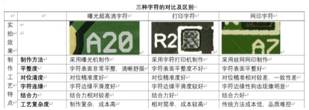

### PCB的加工制作（PCB下单工艺选择）

##### 0. 下单注意事项 
**嘉立创：**
[下单前技术员必看-技术指导-服务指引](https://www.jlc.com/portal/server_guide_112.html)
[下单员必看事项-技术指导-服务指引](https://www.jlc.com/portal/server_guide_111.html)
[嘉立创PCB工艺加工能力范围说明](https://www.jlc.com/portal/vtechnology.html)

[**嘉立创PCB下单服务指引和帮助文档**](https://www.jlc.com/portal/server_guide_35092.html)

[**嘉立创钢网下单流程**-技术指导-服务指引](https://www.jlc.com/portal/server_guide_35103.html)

**捷配：**
[新客户下单必看_捷配极速PCB超级工厂 (jiepei.com)](https://www.jiepei.com/news/notice/2472.html)

##### 1. 板子尺寸
这里注意一下板子尺寸和价格的关系：

PCB 最大板边 
四层板：< 5cm，一个价格；5cm ~ 10cm，一个价格；> 10cm，又是一个价格；
双层板：< 10cm，一个价格；> 10cm，又是一个价格；

注意：拼板 > 7cm 才可以过V-cut机！

##### 2. 板材类别：FR-4，铝基板，CEM-1，22F等； 

[铝基板与覆铜板FR-4的区别 (sohu.com)](https://www.sohu.com/a/162851055_629366)
[FR-4板与铝基板的工艺条件有哪些区别？_百度知道 (baidu.com)](https://zhidao.baidu.com/question/493265051.html)

[FR4和CEM-1这两种板的材质有什么区别吗?_百度知道 (baidu.com)](https://zhidao.baidu.com/question/227946996.html)

综合比较，**FR-4**性能最优，使用**FR-4板材**即可

##### 3. 确认生产稿
个人建议**确认生产稿**
下单之后过一段时间登录嘉立创，会有 3D仿真图 及 每层Gerber图 进行确认，与 PCB 不一样地方可以进行修改；

[嘉立创PCB打样-客户确认订单生产稿是什么意思-PCB相关 (jlc.com)](https://www.jlc.com/portal/q1i21042.html)
[论确认“生产稿功能”的重要性！ (amobbs.com 阿莫电子论坛)](https://www.amobbs.com/thread-5707258-1-1.html)
[为什么我极力推荐选择确认生产稿？-PCB常见问题-服务指引-嘉立创PCB打样专业工厂-线路板打样 (jlc.com)](https://www.jlc.com/portal/server_guide_114.html)

##### 4. 拼板款数
[关于深圳嘉立创拼版费相关规定! (amobbs.com 阿莫电子论坛)](https://www.amobbs.com/thread-5563063-1-1.html)
拼板款数指的是在同一个文件中有不同的板；同一款小板拼在一起**拼板款数是1**；

##### 5. 层压顺序
[嘉立创PCB打样-层压顺序什么意思怎么选-PCB相关 (jlc.com)](https://www.jlc.com/portal/q1i19042.html)
层压顺序是常规顺序： TOP-G1-G2-BOT，不需要特别注明，选我是采购我不清楚这个选项

##### 6. 板材选项
[TG板材的特点优势，TG150、TG170板材有何差异-电子发烧友网 (elecfans.com)](http://www.elecfans.com/d/1187809.html)
考虑到耐温选择**TG值较高**的板材；

##### 7. 字符工艺

字符好坏并不会对PCB实际电气质量产生影响，这里**选择便宜的字符**打印或网版印刷；

##### 8. 阻焊覆盖
在PCB中需将阻焊覆盖设置清楚

选择**过孔盖油**原因：
[过孔盖油和过孔开窗的区别 PCB制作   azj2019的博客-CSDN博客_过孔盖油和过孔开窗的区别](https://blog.csdn.net/azj2019/article/details/106910233)
注意过孔不可与通孔焊盘混淆：
[嘉立创-pad及via的用法!- (jlc.com)](https://www.jlc.com/portal/t6i239.html)

##### 9. 焊盘喷镀
[有铅喷锡和无铅喷锡的选择_alala120的博客-CSDN博客](https://blog.csdn.net/alala120/article/details/86250100)
[PCB板沉金工艺和喷锡工艺区别 - 简书 (jianshu.com)](https://www.jianshu.com/p/1e210fed9b65)

实际用起来均无太大差别，一般有**BGA封装**时才使用**沉金**；
建议**有铅喷锡**（性价比高&手工焊接）&沉金（更好性能&机器焊接），镀金效果太差不使用

##### Others. 其他
产品类型：工业级别；
阻焊颜色：最好使用绿色；
字符颜色：最好使用白色；（白色板子则使用黑色字符）
外层铜厚：选用1oz (盎司) 即可（内层0.5oz）；
线路测试：AOI全测+飞针全测(免费)；
金(锡)手指斜边：否；
金属半边/包边：无；（除非PCB有金属半边/包边设计）
阻抗：无；（除非PCB进行阻抗设计）

个性化服务： 基本上选择默认参数即可；

确认订单方式：建议 由客户自行确认订单；

其余如：板子尺寸，板子层数，板子数量，板子厚度，金手指等等按实际需求填写即可；

##### PS1：开票信息
[电子发票和增值税发票有什么区别-百度经验 (baidu.com)](https://jingyan.baidu.com/article/597035520904decec00740fe.html)
[电子发票和增值税发票有什么区别_百度知道 (baidu.com)](https://zhidao.baidu.com/question/1775002906899548860.html)
**简单来说：没区别；**

##### PS2：PCB生产流程全
[收藏 | PCB生产工艺流程大合集 (qq.com)](https://mp.weixin.qq.com/s?__biz=MjM5NTEwMzgzMQ==&mid=2649268030&idx=3&sn=43e3e9b171d15cd8bf1950dcb264792a&chksm=bee1aa0689962310e5f503f728e45994669c458dda09d19fe41a6f00db0cb754bbd9ebdb9dfd)

##### PS3：关于返单
[嘉立创-重要的事情说一万次：大家批量一定要记住返单！- (jlc.com)](https://www.jlc.com/portal/q6i1115.html)

### 关于开钢网
[什么是钢网?pcb钢网的作用_pcb_电工之家 (dgzj.com)](https://www.dgzj.com/pcb/84258.html)
使用回流焊时需要开钢网！
PS：钢网尺寸大于等于 42\*52 ，可以使用机贴；

### 关于柔性PCB
FPC，Flex Printed Circuit Board，柔性电路板
普通板材使用 FR-4玻纤板，
FPC 使用 PI聚酰亚胺；一般厚度0.2mm；