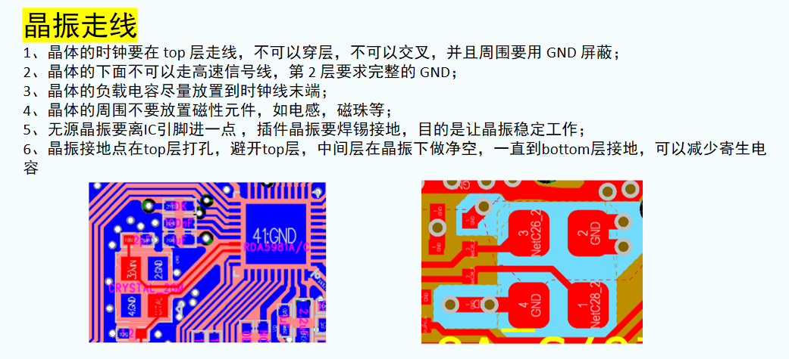
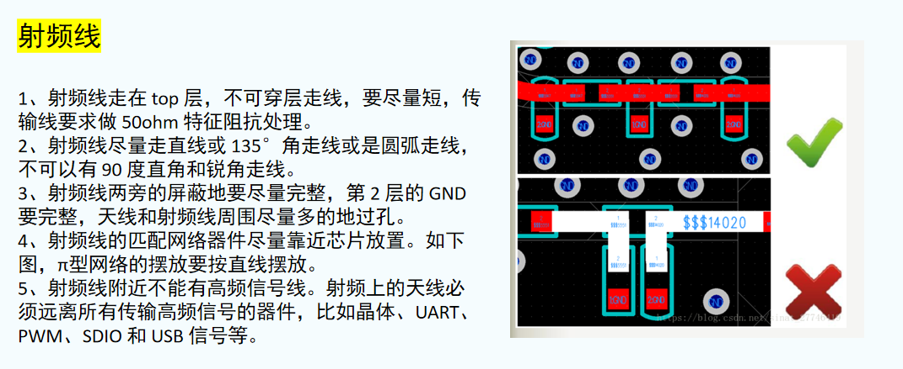
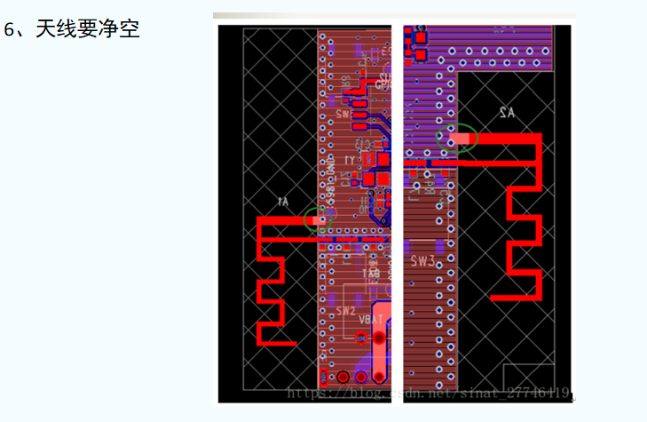
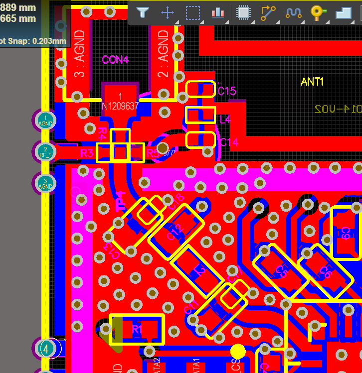
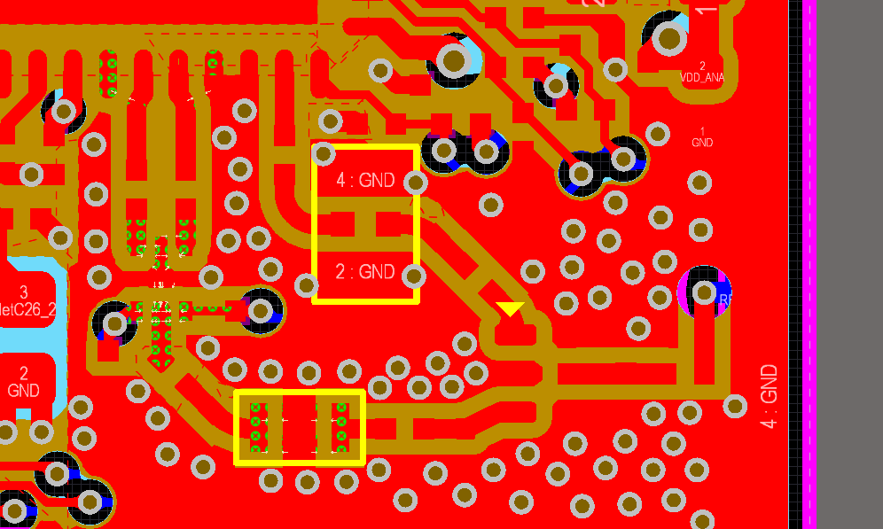

# 目录
[TOC]

## PCB layout
### 1. 绘制流程

##### （完整绘图流程可参考[**Altium Designer 21教学PPT**](.\Altium Designer 21（中文版）电子设计速成宝典-教学PPT)）

#### 1. 元器件导入
导入：
PCB: 设计 → Import Changes From 原理图;（或  原理图: 设计 → Update PCB Document PCB）
注意最后的class和room不要导入；

设计规则检查里，除电气规则，关闭其他规则检查 ，TM复位错误标志

#### 2. PCB板框评估&叠层设置
`TOL`  器件摆放  在矩形区域排列 
板框评估（**机械1层** 绘制板框 (最好圆角矩形)  ,  (灵活使用辅助线) ，取整数，`DSD`；按选择对象定义板子形状，`EOS`设置原点，板框复制到**Keep-out**）
PS：AD19版本前: 板框在Keep-out层，AD19及AD19后，板框在机械1层；
叠层设计（不计成本、极致性能：四层板； 低成本：二层板）
叠层方法见四层板设置部分；

#### 3. 器件布局摆放
参考[**PCB设计布局常用规范及思路**](.\Altium Designer 21（中文版）电子设计速成宝典-教学PPT\第8课 PCB设计布局常用规范及思路.pdf)
参考[PCB布局思路分析](.\PCB布局思路分析.pdf)  /  [【干货分享】PCB布局思路分析 ](https://mp.weixin.qq.com/s?__biz=MjM5NTEwMzgzMQ==&mid=2649309442&idx=1&sn=4a282b8df426243f825ca08ef61b1c29&chksm=bee0743a8997fd2c3545d1b579d0780894cfa7a376133a4382aa608e4f9771245a1d73355e67)      (两个一样)
参考[凡亿EMC Checklist](.\凡亿EMC Checklist.pdf)
参考[分享PCB元器件摆放的小技巧](https://mp.weixin.qq.com/s?__biz=MzI1MDg4OTMwMw==&mid=2247499369&idx=5&sn=30e9b576eddcfb00f230391e07dfae23&chksm=e9f9eb51de8e6247e79821028f0b2e9fe4b7f638a1670a98de1d541e0a3f8bc931cc81a825c8)

垂直分屏，打开交叉选择模式（Shift+Crtl+X）；使用`TC`交叉探针快速定位
选中元器件，右键 → 查找相似对象，`A+P` 批量调整丝印位置；选中所有丝印，批量调整大小；

按照原理图，各个功能模块在板框外部分开
高速信号线类、电源线类、普通线类；建立不同导线类（`DC`）；
隐藏电源类，可以看出信号走向；

按照**模块功能、信号流向、电源线地线属性**等等；**元器件布局摆放**（此步骤**最重要**），<u>**布局时候就要去想好如何走线！**</u>
<u>**布局时候就要去想好如何走线！**</u>
（每一模块的位置摆放(先将主要元器件按照功能模块摆放，在摆放各个小元器件；)  →  模块内具体元器件的摆放  → **提前思考如何连线**（信号线连线，**电源线、地线**连线） → 对齐、美观、局部修正 → ~~最后接线时局部位置修正~~ (尽量在这里就想好怎么走线吧，后面就是微调而不是大改)   ）

**PS：实际器件布局、连接需要参考datasheet**

**PCB 布局，自己先布置完看布局讲解文档是否满足规则；**

> **后补充：**第一次PCB绘制，问题全出在布局里面了！布局时候完全没想到电源，导致后面线什么都连接好了，铜皮也铺好了，因为电源走不通，改啊改，改啊改。。。甚至电子隔离器件，连接好了猜想到还没放上去。
> 布局一定做好啊，试想想，如果你PCB都绘制好了，发现布局不合格，会怎么样。。。毁灭吧 \_(:3 ⌒ﾞ)\_ 。。。

#### 4. 设计参数与规则
参考[PCB设计中的规则约束](.\Altium Designer 21（中文版）电子设计速成宝典-教学PPT\第9课 PCB设计中的规则约束.pdf)
[**浅谈PCB设计各种各样的安全间距问题** - 电子说 - 电子发烧友网 (elecfans.com)](http://www.elecfans.com/plus/view.php?aid=1310630)

Width右键：新建规则，改名PWR，试用于Net Class→PWR网络， 注意优先级设置和使能；

**设置所有规则，记着先应用规则，之后确认；**

**一般需要设置规则：**
间距 → 线宽 → 过孔 → 铺铜 → 阻焊&丝印

**规则常见设置参数：**

| 指标名称 | 常用范围 |
| -------- | -------- |
| 板厚                         | 2层板：0.8、1.0、1.2、1.6 4层板：1.2、1.6、2.0 |
| 走线宽度（数字、模拟、电源） | 6 (省空间) ~ 10 (大空间) mil，电源10 (小功率) ~ 20 (大功率) mil 大电流甚至可至60mil |
| 过孔内径、外径               | 经验：外径 = 2倍内径 ± 2mil 空间受限 (信号、电源) ：**8**~10mil、**~~16~~(18)**~22mil 空间较大 (信号、电源) ：**10**~12mil、**~~16~~(20)**~25mil 大电流可 15mil ~ 30mil； |
| 走线间距（线→过孔）         | ~~4 ~~~ **<u>6</u>** ~ 10mil；空间受限6mil，一般10mil最常见；  |
| 丝印字符（字宽/字高）              | 4/25mil、5/30mil、6/40mil                                   |

**过孔规则设置**：
设置(TP) → PCB Editor → Default → Via ，更改默认过孔大小
设置(TP) → PCB Editor → Default → Via → Solder Mask Expansion → Tented    过孔选择覆盖绿油

选择过孔盖油原因：
[过孔盖油和过孔开窗的区别 PCB制作   azj2019的博客-CSDN博客_过孔盖油和过孔开窗的区别](https://blog.csdn.net/azj2019/article/details/106910233)
注意过孔不可与通孔焊盘混淆：
[嘉立创-pad及via的用法!- (jlc.com)](https://www.jlc.com/portal/t6i239.html)

**铺铜规则设置：**
三个规则分别为：内电层（负片层）→ 反焊盘（建议最小间隙6~10~20mil） → 正片层（信号层）	
高级设置：过孔全连接，**焊盘使用默认参数十字连接（手工焊接）**或全连接（机器焊接）

铺铜到板边距离 (Keep-out层板框) 设置 0.3mm (省空间) ~20mil (大空间)；
PWR层和GND层相比，也要内缩10mil (省空间) ~20mil (大空间)；

**阻焊&丝印规则设置：**
阻焊间距：0.05mm~10mil  (>0 表示需要检查，=0 就不检查了)
最小丝印间距&丝印到阻焊间距：0.05mm~2mil  (>0 表示需要检查，=0 就不检查了)

**PCB规则设置完后，看规则设置文档，是否满足规则设置要求；**

#### 5. 走线
参考[**PCB设计布线操作及技巧**](.\Altium Designer 21（中文版）电子设计速成宝典-教学PPT\第10课 PCB设计布线操作及技巧.pdf)
参考[**PCB设计布线要点分析**](.\PCB设计布线要点分析.pdf)

参考[凡亿EMC Checklist](.\凡亿EMC Checklist.pdf)
参考[布局走线常见问题检查汇总](.\QA常见问题检查汇总.docx)

[高频PCB布局布线10个注意事项](https://mp.weixin.qq.com/s?__biz=MzA5NDE1NjcxMw==&mid=2456182794&idx=3&sn=d9e091a9e88ff0a0f0ac75ef1e8a14da&chksm=87c022ccb0b7abda7f561c7d68fe054a1c674c284e7421577cb4150b8b92fa269edf0d571ac7)
[【经验交流】你的产品怎样进行抗干扰设计? (qq.com)](https://mp.weixin.qq.com/s?__biz=MjM5NTEwMzgzMQ==&mid=2649310087&idx=1&sn=a4fad4e2c053b81464001c732098a242&chksm=bee076bf8997ffa9a6a8e810813d2baf315c10bed6c09495250e4c1c0b9f057299ef5035fcda)

**先粗略连线，要求：**
**先连接<u>高频信号线</u>：短，直（弯曲使用弧线不使用45°折线），不能使用过孔，要补泪滴，注意3W原则；**
高频信号线下不连接铜皮；天线要多打GND孔进行隔离；
详见高频信号线连接注意事项；

**之后模拟信号线**：尽量不打孔，在单一平面走线；走线要尽量短，直，注意3W原则；

**之后数字信号线**：要少打孔；

**最后电源线**：先思考如何分割平面，之后就近多打孔；由于载流，电源线、过孔适当加粗；
                      （**注意通过修改规则而修改走线、过孔粗细、大小**，过孔也可以打孔完使用查找相似对象来修改）
                       电源线打孔走好，先走电源线；之后想清楚地平面分割，走GND线，最后在进行铺铜！
                       设置好铺铜规则，直接**在整个平面铺GND铜即可！最后一点一点去除尖角铜皮！**
​                       注意铺铜设置，（参考后面的铺铜讲解）
​                       PS：实际电源线、地线线宽、过孔要考虑到[载流](http://www.elecfans.com/d/1055223.html)！
​                       [PCB 线宽与电流关系怎样计算-电子发烧友网 (elecfans.com)](http://www.elecfans.com/d/1055223.html)

**<u>注意连接不同线时切换线宽和过孔大小！！！</u>**

**在进行引线局部调整&铺铜优化**
优化：
线减少弯折，尽量等间距，尽量走中间，走线注意3W原则，尽量减少环路面积，走线不要出现单端 (类似天线) 等等；
线宽不一致补滴泪，多层布线尽量正交，焊盘引线尽量外部，不要直接把焊盘连载一起；

铺铜优化：主要铺**GND铜皮**；注意去除死铜，去除器件焊盘间铜皮，使用多边形挖空去除尖角铜皮（可铺曲线轮廓铜皮）；
最后注意T+E补泪滴；

**PS：实际器件布局、连接需要参考datasheet**

**PCB 走线同布局，自己先走线后看走线讲解文档是否满足规则；**

**<u>PS：自己 Others 还有一部分注意事项！可以参考。</u>**

#### 6. 检查调整丝印
按 L ，只开启丝印、焊盘阻焊层，调整丝印大小位置；

以下是丝印位号调整遵循的原则及常规推荐尺寸
1）丝印位号不上阻焊，放置丝印生产之后缺失
2）丝印位号清晰，字号推荐字宽／字高尺寸为4 / 25，5 / 30，6 / 40mil
3）保持方向统一性，一般一块PCB上不要超过两个方向摆放，推荐字母在左或在下

[【经验分享】还在傻傻的一个个调整PCB元件的丝印位号？ (qq.com)](https://mp.weixin.qq.com/s?__biz=MzU4Nzg5NzU5MA==&mid=2247495287&idx=1&sn=ae500438e316d04a5f08ec9179c45572&chksm=fde7a1eeca9028f892a001c8a13f4326b2ed9e6031947748ff957da4b8aebbad0527cd1f4e34)

#### 7. DRC检测
打开要检测的规则，确定，之后运行DRC；
检测 → 修改调整 → 检测

#### 8. Gerber输出
需要输出文件：
* 装配图输出
* BOM表输出
* Gerber文件输出

装配图输出：
文件 → 智能PDF → 依次导出 原理图+BOM、正常PCB、拼板PCB，和一个完整的 → PCB打印设置：点击Name，Create Assembly Drawing（打印装配文件），双击Top层最前空白，输出锡膏层，阻焊层，丝印层，板框层（注意顺序）；Bottom层同理；之后右侧，Include Components全选上，Design Views全选上，底层选择Mirror；   下方选择Entire Sheet（整体打印）→ 原理图彩色打印，PCB图彩色打印；

BOM表输出：
报告 → Bill of Materials → 点击Export导出；
（PS：导出文档可以删掉不要部分，自己做BOM可以在后面加上 器件购买链接）

Gerber输出：
* 文件 → 制造输出 → Gerber Files → 通用：单位:英寸，格式:2: 4；层：绘制层:选择使用的，镜像层:全部去掉，出图选项，去掉:机械层、Pad Master层，右侧添加到所有层的机械层打√；钻孔图层：输出所有钻孔对；光圈：默认即可；高级：胶片规则:在后面加0，因为可能胶片小板子放不下；点击确定输出即可；
* 文件 → 制造输出 → NC Drill Fills → 通用：单位:英寸，格式:2: 4，点击确定输出即可；
* 文件 → 装配输出 → Generates pick and place files → 英制单位，文本格式，点击确定输出即可；（坐标文件，用于定位）
* 文件 → 制造输出 → Test Point Report → IPC-D-356A，点击确定输出即可；（IPC网表，板厂对PCB开短路核验）

**工程文件后期整理：**
* CAM文件夹：Gerber文件，包含：Project Outputs 第一个图标为绿色十字 Gerber 以下的所有文件，建议包含所有输出；发至板厂；
* ASM文件夹：装配文件，包含：BOM表，装配图，坐标图，GTP / GBP文件（Gerber Top / Bottom Paste，开钢网使用）；发至贴片厂；
* BOM文件夹：包含：BOM表；采购人员使用；
* PRJ文件夹：包含：.PrjPcb、.PcbLib、.PcbDoc、.SchDoc、.SchLib、导出到装配图（原理图）；工程人员使用；
* **其余文件可以删除。**

#### PS：实际器件连接可以参考datasheet

### 2. AD软件使用讲解
#### 2.1 AD常见快捷键
[AD常用快捷键总结\_芒果爱火锅的博客-CSDN博客\_ad快捷键](https://blog.csdn.net/woshiyuzhoushizhe/article/details/97000298)

**常用快捷键：**
TC                         交叉探针   快速定位
TOL                      器件摆放   在矩形区域排列 
P+D                      放置线性尺寸

Q                          点击黑框、切换mil和mm显示（1mil = 0.0254mm）
Crtl+Q                 输入长度时，切换mil和mm显示（1mil = 0.0254mm）

右键                     移动视野
Crtl+右键             放大缩小
Crtl+滚轮             放大缩小
滚轮按下              放大缩小
Shift+右键           三维图中旋转
Shift                     多选

Shift+S                 所有层显示/高亮当前层/仅显示当前层
Crtl+单击             高亮显示含当前网络所有焊盘&连线&过孔…
N                          显示/隐藏网络

选中器件空格      旋转器件
选中器件X            X镜像器件
选中器件Y            Y镜像器件

Crtl+W                 原理图连线（也可：P+W），PCB交互式连线（也可P+T，比P+L普通线好用）
P+L                       PCB连线，建议用Crtl+W交互式连线（原理图为画线，无电气属性）
Shift+空格           连线&铺铜模式更改（45°斜线 / 45°圆角 / 90°直角线 / 90°圆角 / 任意斜线；注：必须英文输入法）
Tab                      暂停，此时可以操作右侧工具栏
连线+Tab             快速修改连线长度

TG                        重新铺铜（TGR，TGA，TGV，TGO；重铺选中的，所有的，冲突的，修改过的）

Crtl+M                 测量距离（Shift+C，取消测量距离标注）
Shift触碰网络      高亮该网络

S+N                       选择含当前网络所有器件
E+A                       特殊粘贴（先进行复制）
A+P                       选中器件，对丝印位置进行调整

A                            对齐&均匀分布
M                           移动

L                            显示/关闭层
\*                            快速切换层（表层/底层/内电层）
\+ -                          快速切换层（所有层）

##### **一些常见操作：**
建议：AD的Properties工具栏一直开启：（点击AD固定选项）

一条线左右两端和中间三个端点；  
点击线中间端点                     在中间拉出新线
点击线其他位置                     走线上下移动
点击线两端端点                     按住Crtl进行调整（Crtl 键有 **微调** 的作用，移动连线移动不了，就按Crtl）

右键 → 联合                           器件联合操作（去掉：从联合打散）
锁定器件                                 防止元器件误移动
右键 → 查找相似对象            进行批量操作

器件导入 (原理图更新)          PCB: 设计 → Import Changes From 原理图;（或  原理图: 设计 → Update PCB Document PCB）
器件更新                                 SCH Library,  更改后保存,  右键更新原理图 | PCB Library,  更改后保存,  右键Update PCB with ×××

原理图检查                             AD21:  右键单击项目 → Validate PCB Project ×××；AD20:  Compile PCB Project ×××
原理图规则修改                     右键单击项目 → 工程选项

定位孔绘制                             放置过孔 → 内孔外孔大小一致 → 注意过孔不要覆盖绿油！

批量修改                                 灵活运用查找相似对象进行批量修改

#### 2.2 部分AD操作讲解
#### 2.2.1 四层板的设置 / 四层板 or 二层板优缺点选择
D+K   层叠管理器，右键单击某层，Insert layer above/below → Signal  (正片)  / Plane  (负片)  ；
更改层名：GND02，PWR03；建议在 L 中，改GND、PWR层颜色 (建议：土黄、天蓝) 方便看清走线铺铜；

注意PCB设计，电源层比GND层要内缩约10~20mil；
[PCB设计电源层比GND层要内缩这样处理有什么好处？_百度知道 (baidu.com)](https://zhidao.baidu.com/question/624653190617935572.html)

五五原则与叠层设计相关，20H原则与内缩相关
[PCB设计中的三大原则_3W原则、20H原则、五五原则](https://blog.csdn.net/weixin_43793007/article/details/108184014)

四层板二层板特性比较：
[四层板比起二层板有什么优点？-电子芯吧客（www.icxbk.com）](https://www.icxbk.com/ask/detail?tid=31013)
[实测对比：2层和4层板的干扰和辐射差异 (baidu.com)](https://baijiahao.baidu.com/s?id=1700145206185367013)

**四层板在表层和底层间增加了地层和电源层，以下是对比总结：**

**1.四层板的特点：**
1）有中间参考平面，可以进行阻抗匹配计算
2）增加了地层和电源层，回流路径更短，从而使屏蔽效果更佳，抗干扰能力更好
3）层数更多，使用内电层布线，设计更简单，占用体积更小
4）成本要高一些，简单（低速）电路使用二层就可以达到理想效果

**2.什么时候选择做四层板：**
1）器件过多走线过于复杂
2）走线密度不高，两层可以搞定；但基于信号质量考虑，信号的质量优先，则选择使用四层板

#### 2.2.2 铺铜事项讲解
**1\. 铺铜网络选择：**
**pour over all same net objects:对于相同网络的焊盘、导线以及覆铜全部进行连接和覆盖。**
do not pour over all same net objects：仅仅对相同网络的焊盘进行连接，其他如覆铜、导线不连接。
pour over same net polygons only：仅仅对相同网络的焊盘、覆铜进行连接，其他如导线不连接。

选择：Remove Dead  Copper   移除死铜；
（小面积死铜移除，大面积死铜过孔连接至GND）

[【AD小知识】关于PCB中的死铜\_悟已往之不谏 知来者之可追-CSDN博客\_ad死铜移除](https://blog.csdn.net/ReCclay/article/details/79238636)

**2\. 实心铺铜（Solid） & 网格铺铜（Hatched）**
[电路板采用网格覆铜还是实心覆铜，你用对了吗？_作用 (sohu.com)](https://www.sohu.com/a/295208530_120085093)
[网格与实心覆铜比较 - 百度文库 (baidu.com)](https://wenku.baidu.com/view/d4c690392f60ddccda38a0b7.html)

**3\. 曲线铺铜注意事项**
曲线铺铜两个方法，一个是 按Shift+空格，直接创建曲线铺铜；
另一个，画出曲线，之后TVG，转换 → 选中元素创建铺铜；相比这种方法更简单……
其实不是特殊PCB**完全没必要搞**曲面铺铜……

**4\. 其他铺铜讲解**
[如何聪明的铺铜 - PCB设计 - 电子工程世界-论坛 (eeworld.com.cn)](http://bbs.eeworld.com.cn/thread-467935-1-1.html)
[PCB铺铜的意义及步骤 - PCB设计 - 电子发烧友网 (elecfans.com)](http://www.elecfans.com/article/80/2020/202010191336199.html)
[PCB学习笔记——PCB的铺铜方法_齐天大圣的博客-CSDN博客_pcb铺铜](https://blog.csdn.net/mao_hui_fei/article/details/88084228)

#### 2.2.3 铺铜脚本使用
铺铜脚本添加：文件 → 运行脚本 → 浏览 → 添加脚本路径 → prjscr； 运行脚本 FY.main

#### 2.2.4 组分Properties选取
Components   元器件
Keepout   板框
Tracks   走线
Arcs   弧线走线 
Pads   焊盘（脱离器件）
Via   过孔
Regions   区域覆铜（区域挖空）
Ploygons   多边形覆铜（就是铜皮）
Fill   覆铜
Texts    文字注解

防止选错另一个方法：锁定器件位置，防止错误移动；

#### 2.2.5 PCB各层含义作用
L键 关闭/显示 某一层
电路层 / 丝印助焊阻焊层 / 机械层 / 过孔层

[PCB各层的含义（讲的非常易懂清晰）_Eureka1024的博客-CSDN博客_pcb各层作用详解](https://blog.csdn.net/m0_37697335/article/details/83040011)
[PCB各层的含义 （solder paste 区别）_bahutou, 嵌入式系统解决方案-CSDN博客_solder层](https://blog.csdn.net/zhanglianpin/article/details/44174423)

[AD相关_cula的博客-CSDN博客](https://blog.csdn.net/weixin_42417585/article/details/104198214)
（Bottom Assembly Top Courtyard）

[画PCB的时候，禁止布线层和机械层各有什么作用？_百度知道 (baidu.com)](https://zhidao.baidu.com/question/937788117419241892.html)

PCB各层定义，Gerber文件各层定义
[PCB各层定义及输出Gerber文件定义 - 百度文库 (baidu.com)](https://wenku.baidu.com/view/a080b1d576eeaeaad1f33086.html)

#### 2.2.5 泪滴
T+E   补泪滴
泪滴作用：

- 避免电路板受到巨大外力的冲撞时，导线与焊盘或者导线与导孔的接触点断开
- 焊接时，可以保护焊盘，避免多次焊接时焊盘的脱落
- 减小蚀刻的不均匀，减小过孔偏位出现的裂缝等
- 信号传输时平滑阻抗，减少阻抗的急剧跳变，避免高频信号传输时由于线宽突然变小而造成反射，使走线与元件焊盘之间的连接趋于平稳过渡化
- 使PCB电路板显得更加美观

[Altium pcb中泪滴的作用有哪些？该如何添加泪滴？ (baidu.com)](https://baijiahao.baidu.com/s?id=1613905986482250903)
[PCB中是否有必要补泪滴 - PCB设计 - 电子工程世界-论坛 (eeworld.com.cn)](http://bbs.eeworld.com.cn/thread-478654-1-1.html)

#### 2.2.6 电源布线-星型布线样式
[1.02 射频器件电源布线-星型布线-20200312_lb24001的博客-CSDN博客_电源星型走线](https://blog.csdn.net/lb24001/article/details/104812610)

#### 2.2.7 logo导入
**导入方法1：**
添加 logo 导入脚本，
图片使用 画图 另存为 单色.bmp 位图，
运行脚本，Load加载bmp单色图片，选择丝印层，Convert转换导入，
导入logo → 从器件生成联合 → 调整联合大小（在联合选项中）→ 点击联合进行调整；
复制粘贴入PCB中；

**导入方法2：**
https://oshwhub.com/1378dm/better-pcb-picture

#### 2.2.8 是否进行拼板及拼板的步骤
[拼板---凡亿PCB](.\PCB拼板认识及PCB拼板设计（一）.pptx)

**作用：**
大批量生产中节约成本提高效率；

**类型：**
V型切割 & 邮票孔拼板；
V型切割试用于直角拼板；邮票孔试用于异形拼板

**方法：**
[【经验分享】Altium Design PCB拼板完整教程，这样讲就明白了！ (qq.com)](https://mp.weixin.qq.com/s?__biz=MjM5NTEwMzgzMQ==&mid=2649310622&idx=1&sn=47b23b490bdf81856f9dee1f6eaba182&chksm=bee070a68997f9b0cc7f2889606d3b59eccc0efa22bdd965b0e4e5df25e5ee88a023228977b0)
[AltiumDesignPCB拼板完整教程 基于AD09版本 - 百度文库 (baidu.com)](https://wenku.baidu.com/view/86f2fb60d4bbfd0a79563c1ec5da50e2524dd186.html)

[PCB拼板的分割V-CUT创建方法](https://wenku.baidu.com/view/f9636e13bc1e650e52ea551810a6f524ccbfcbe4.html)
建立拼板PCB：
&nbsp;    新建PCB → 放置 → 拼板阵列 → 按 Tab 暂停 → 右侧工具栏选择：PCB Document（要去拼板的PCB），几行几列，板间距（板间距应设为0）等；→ 确定 → 选择自动同步；

PS：旋转拼板，插入一拼板阵列后，在插入另一拼板阵列，空格 旋转180°即可；

添加工艺边：
&nbsp;    绘制左右5mm工艺边，DSD使用工艺边作为新板框；

添加工艺孔：
&nbsp;    添加直径3mm过孔，焊盘内层外层大小一致，注意不要覆盖绿油！
&nbsp;    固定孔内移2.5mm；
&nbsp;    外部3个方向打表接焊盘（大小: 1mm × 1mm；距离: 3.5mm × 1mm），放置定位点；

（PS：修改PCB，拼板会自动同步修改）

**工艺边讲解：**
[为什么PCB要求使用工艺边-电子发烧友网 (elecfans.com)](http://www.elecfans.com/d/1682859.html)
[PCB工艺边设计时需要注意哪些问题 - EDA/IC设计 - 电子发烧友网 (elecfans.com)](http://www.elecfans.com/bandaoti/eda/202003091177545.html)
[工艺边介绍及其作用 (baidu.com)](https://baijiahao.baidu.com/s?id=1706671668423884604)

**成本考虑**
使用V-cut切割，因为要过V-cut机，所以会额外增加成本；**算下来不比单独打板便宜！**
如果考虑贴片，需要增加工艺边，加工工艺边必须要过V-cut切割机，过V-cut切割机又必须 > 7mm……，小板子就必须拼板；
在PCB制板和贴片间进行成本权衡吧……

#### 2.2.9 定位孔绘制方法
放置过孔 → 内孔外孔大小一致 → **注意过孔不要覆盖绿油！**

#### 2.2.10 批量添加过孔
[Altium Designer19添加缝合过孔&屏蔽孔操作 (360doc.com)](http://www.360doc.com/content/20/0929/09/35356821_938110849.shtml)
THA，给网络添加缝合孔，
点击约束区域，选择添加缝合孔的区域，
填写缝合孔的参数，点击确定。

如果移除过孔，THR，移除缝合孔组，

屏蔽孔添加同理，选择需要添加的网络，填写屏蔽孔参数，添加；

#### 2.2.11 差分信号线布置
1\. 什么是差分线：
[什么是差分线? - 朱果果 - 博客园 (cnblogs.com)](https://www.cnblogs.com/y4247464/p/15386052.html)
[差分信号线的原理和优缺点分析 - 知乎 (zhihu.com)](https://zhuanlan.zhihu.com/p/535230952)
[什么是差分线？三分钟看懂差分线！硬件工程师电路设计基础知识！ - 百度文库 (baidu.com)](https://wenku.baidu.com/view/1222a00e5a0102020740be1e650e52ea5418ce5f.html)
用两条平行的，等长的走线传输相位差180°的同一信号。
如：
长距离传输，网线，485，CAN；
高速传输， USB3.0、MIPI、LVDS、SATA；

2\.差分线绘制：
[Altium Desinger怎么走差分蛇形线、单线蛇形线\_子曰小玖的博客-CSDN博客\_ad差分走线](https://blog.csdn.net/wxh0000mm/article/details/78814404)
原理图中，对差分线放置差分对（注：差分线需前缀名相同，后缀分别为\_N，\_P）；
PCB图中，设置差分线规则 → 交互式差分对布线（PS：交互式布线（Crtl+W），交互式总线也都在这里）；

#### 2.2.12 晶振
[【知识分享】晶振决定数字电路的生与死 (qq.com)](https://mp.weixin.qq.com/s?__biz=MjM5NTEwMzgzMQ==&mid=2649311425&idx=1&sn=b89b2bf9af98e18f97035bdb76f375fd&chksm=bee07df98997f4efd8ced43b06f9c47aea86324980e873d4ad8dc1b059f11ab052d9831ac274)
[【知识分享】晶振为什么不能放置在PCB边缘？](https://www.zhihu.com/question/61410549/answer/1150991864)

在设计PCB时,遇到贴片晶振,一般需要做两种处理：**1、周围包地的处理,2、挖空晶振下方的平面层。**
包地处理是EMI考虑，挖空是因为寄生电容的原因和抑制热传导导致的频偏。
这些都是相对的，看产品设计的严谨程度以及晶振的使用场景。如果是TCXO或DCXO，最好这两者都做处理。
[贴片晶振邻层挖空背后的原理 - 知乎 (zhihu.com)](https://zhuanlan.zhihu.com/p/40516869)
[究竟为何在贴片晶振邻近平面层挖空，这样的操作有何用意？-电源网 (dianyuan.com)](https://www.dianyuan.com/article/55525.html)

#### 2.2.13 灵活运用查找相似对象进行批量修改
灵活运用查找相似对象进行批量修改！！！

#### 2.2.14 PCB背面操作注意事项
一定注意，PCB 背面进行操作，都是从正面去看背面的，实际操作要记着按X / Y进行镜像！
（PS：包括Datasheet，封装图，看清楚引脚次序，正面看还是背面看的！）

#### 2.2.15 裸露铜皮
**为什么裸露铜皮**
[PCB中裸露铜皮的作用？模拟电子技术论坛-模拟技术 - 21ic电子技术开发论坛](https://bbs.21ic.com/icview-160107-2-69.html)
裸露的铜皮可以起到 ：散热；降低阻抗，增加过电流（比如加锡在露铜区）；抗干拢，与外壳金属接触起屏蔽作用，接安全地，也为[屏蔽罩](https://baike.baidu.com/item/屏蔽罩/2828508)做准备；

**如何裸露铜皮**
阻焊层是负片层，所以在需要露出铜皮的地方布置上阻焊即可露出；
（E+A，将走线、铺铜特殊粘贴到阻焊层即可）

#### 2.2.16 PCB设计的三大原则
[PCB设计中的三大原则_3W原则、20H原则、五五原则](https://blog.csdn.net/weixin_43793007/article/details/108184014)

3W原则：在PCB设计中为了减少线间串扰，应保证线间距足够大，当线中心间距不少于3倍线宽时，则可保持大部分电场不互相干扰；
20H规则：[要确保电源平面的边缘要比GND平面边缘至少缩入相当于两个平面间层距的20倍](.\PCB设计中电源平面相对地平面为什么要内缩.pdf)；
五五原则：时钟频率到5MHz或脉冲上升时间小于5ns，则PCB板须采用多层板。

#### 2.2.17 过孔是否可以打在焊盘上

[pcb过孔到底可不可以放焊盘上？ - 知乎 (zhihu.com)](https://www.zhihu.com/question/53848637)

**过孔在焊盘上带来影响：**
&nbsp;   	首先说明Via孔。Via孔大概理解就是电钻在电路板钻个孔，孔壁镀上金属，让上下两层导通。所以孔是空心的，然后壁的金属镀层非常薄的，所以电阻也相对大。
&nbsp;	   自己焊接的话可以往里面灌焊锡(其实就是焊接时锡流进去了)，但因为这灌锡原因，贴片机去焊的话，锡膏不足，锡融化后可能有的流进孔里，造成虚焊，又或者锡张力不平衡问题，造成某一边焊接后翘起也虚焊。
**总结：**
+ 如果是自己用焊锡丝手工焊，可以随意放。

+ 如果是大于[0603]的规格，可以随意放.

+ 如果是用锡膏，在焊接小尺寸贴片(0603以下)时，如果有过孔确实会造成一些困扰。有可能会因为两侧锡浆的张力不对称, 从而引起元件翘起，造成焊接上的问题；或者锡膏不足，锡膏熔化后流入孔内，造成虚焊。
  密集引脚，又不是手工，一般不打在焊盘上。

#### 2.2.18 Net Antennae 错误

Net Antennae，就是有不封闭的连接线(过孔)。比如某线(过孔)连接的时候，就像天线一样，有开始，没有结尾。悬空在那里。 
[AD2019 Net Antennae错误的一个解决案例\_LostSpeed的博客-CSDN博客\_netantennae错误](https://blog.csdn.net/LostSpeed/article/details/111238904)
[使用AD画PCB报错Net Antennae: Track....的解决方案\_小马哥电子开发学习的博客-CSDN博客\_ad銝要et antennae](https://blog.csdn.net/mzw72188552/article/details/88692099)

#### 2.2.19 过孔和通孔焊盘的区别

[【AD小知识】过孔和焊盘的区别\_ReCclay的博客-CSDN博客\_ad焊盘和过孔的区别](https://recclay.blog.csdn.net/article/details/79265845)
[PCB中过孔和通孔焊盘的区别\_行走在路上SJ的博客-CSDN博客\_过孔和通孔的区别](https://blog.csdn.net/u014073301/article/details/74518795)

1\. 焊盘默认露出铜皮，过孔默认盖油；过孔也可以开窗，此时二者类似；
2\. 由于孔内需要镀锡，过孔孔径会稍小，焊盘则不会。

#### 2.3 PCB 布置 其他注意事项
[【经验分享】优秀的PCB工程师必须拥有这7个好习惯 ](https://mp.weixin.qq.com/s?__biz=MjM5NTEwMzgzMQ==&mid=2649310179&idx=1&sn=242fa44173fdea4c03dbd9d488d9d025&chksm=bee076db8997ffcdea97f8caffa8aac6c16f4876645ce6775b78914c1f751a22c2ae91eb4c86)
[你一定要了解的12个PCB Layout细节 (qq.com)](https://mp.weixin.qq.com/s?__biz=MjM5NTEwMzgzMQ==&mid=2649312657&idx=1&sn=2f75d5e7830864a3d8d7686848a5b83c&chksm=bee078a98997f1bf2fefd9b8148f1c46c791979817d6babe85f7ecd3e62730a49bbdf1cbacf8)
[PCB Layout的这些要点，建议重点掌握 (qq.com)](https://mp.weixin.qq.com/s/H6hRIYkOdiV39dt22_ebmQ)
[警惕：别让这些设计中的小细节毁了你整个PCB设计！](.\警惕：别让这些设计中的小细节毁了你整个PCB设计！.pdf)

[104条 PCB 布局布线技巧问答，助你画板无忧！ (qq.com)](https://mp.weixin.qq.com/s?__biz=MjM5NTEwMzgzMQ==&mid=2649281028&idx=1&sn=3e6b63172d494efec5804d1dba9d1106&chksm=bee1e73c89966e2a4d00592c904f4e7789fb4b47430bba8abef2705c962c5e5e250cba023c88)
[【好文分享】长文预警！高频PCB电路设计常见的66个问题 (qq.com)](https://mp.weixin.qq.com/s?__biz=MjM5NTEwMzgzMQ==&mid=2649312106&idx=1&sn=b1a9f16a26c3a655deab6fe51ea2abce&chksm=bee07e528997f744d9a1d8872b6da1845351b23dc8fc856aaf8d912a60d74fdd6e2c49ebb110)

[【经验分享】PCB 过孔对散热的影响 (qq.com)](https://mp.weixin.qq.com/s?__biz=MjM5NTEwMzgzMQ==&mid=2649311656&idx=2&sn=75746567d50266c166073883006f3976&chksm=bee07c908997f586b1c0cfc59f032e973cafaa42a421bbafabeffc6a928094b4f34f467e88bd)

**[PCB走线规则](.\pcb走线规则.docx)**

### 3. PCB layout注意事项
#### 3.1 高频layout注意事项
**高频线路下面不接铜皮，保持静置；天线周围使用GND孔隔离；不要有弯折，走直线&弧线！**
**注意信号线后期补滴泪**
**<u>（主要包括：晶振，天线！）</u>**

> 缝合孔技术可以将不同层中的较大的铜箔连接到一起，在板结构中进行垂直连接，同时保持较低的阻抗和较短的回流路径。**在RF设计中，缝合孔与护环一起创建一个过孔墙，以创建电磁屏蔽PCB。**缝合孔也可以被用来连接那些独立于网络的铜箔，将其与网络连接起来。

#### 3.2 天线

[射频PCB设计，你一定要注意的几个方面 (qq.com)](https://mp.weixin.qq.com/s/6MPIRnJTZqlDxamGuLrmIA)
[高速pcb设计当中为什么要控制阻抗](.\高速pcb设计当中为什么要控制阻抗.pdf)

#### 3.3 晶振&天线 layout（淘宝工程师讲解）
1\. 晶振走线

2\. 射频电路走线

3\. 天线布置

4\. 实例

[实例讲解：(SI4438)](https://www.cirmall.com/circuit/14478/)

#### 3.4 线宽
[PCB 线宽与电流关系怎样计算-电子发烧友网 (elecfans.com)](https://m.elecfans.com/article/1055223.html)

### 4. 原理图补充

原理图切换图纸大小                   [原理图切换图纸大小](https://blog.csdn.net/qq_24118527/article/details/110499405)
原理图标注                                  TAA 工具 → 原理图标注 (Reset All 位号复位为? / 更新更改列表 位号更新为 多少)  → 执行变更
原理图位号 / Value值                 Designator / Comment
原理图常用编号                          [原理图常用编号](.\Altium Designer 21（中文版）电子设计速成宝典-教学PPT\第5课 原理图的绘制操作.pdf)、[各种元件的编号名称](https://wenku.baidu.com/view/331196826529647d27285227.html)
端口/网络区别                             [端口/网络区别](https://blog.csdn.net/qq_28237535/article/details/49247275)
原理图库 置于顶层 / 底层          快捷键M 移到前面 / 后面
原理图 元器件对称翻转             左右翻转：X键；上下翻转：Y键
封装统一管理                              工具 → 封装管理器
